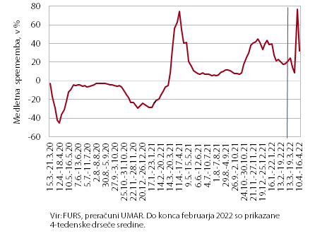

---
output:
  pdf_document: default
bibliography: M:/literatura/zotero.bib
---


## Vizualizacija medletnih sprememb tedenskih podatkov


Spodnji graf odpira par pomembnih vprašanj glede vizualizacije podatkov in celostne grafične podobe Umarja. 


```{r echo=FALSE, out.width='100%'}

```


Za pomoč me je prosila Mojca K., ki jo moti naslednje: 

1. Podatki so tedenski, ampak na x-osi ni dovolj prostora za vse oznake
2. Podatki so tedenski, ampak za nazaj nas ne zanima gibanje tako natančno, za zadnja dva tedna, ki ju komentiramo, pa je seveda fino, da se vidi gibanje. Rešitev je prelom med drsečimi sredinami do neke točke in potem surovi podatki za zadnjih 5-8 tednov, ampak to je treba delati ročno in na pamet. 
3. skratka rada bi vse podatke na grafu, pa da je vseeno še pregleden. 

Ima pa ta graf v tej obliki še ene par stvari, ki mi niso samoumenvne:

4. tedni se merijo od nedelje do sobote, kar je precej nenavadno v našem kulturnem okolju.
5. graf z isto črto v resnici prikazuje dve spremenljivki: medletne spremembe v tedenskih vrednostih in pa 4tedenske-drseče sredine medletnih sprememb tedenskih vrednosti. To sta dve (sicer povezani) spremenljivki in ju je zato treba ločeno prikazati - torej različno obarvati in v legendi označiti.
6. sama navpična črta ni nikjer pojasnjena. (To  smo sicer dodali v EO zadnjič za porabo elektrike). 
7. 4-tedenske drseče sredine na grafu so poravnane na desni. to uvaja zamik v zglajeno spremenljivko kar je problem, če se spremenljivka kar nadaljuje v drugo, nezglajeno. [demo](https://tjeld.uia.no/shiny/valeriz/centered-vs-right/)
8. medletne spremembe se računajo glede na isti datum prejšnje leto (10.-16.4. 2022 se primerja z 10.-16.4 2021). to je mal awkward, sploh pa kaj narediš 29.2., ko nimaš lanskega datuma. 
9. Prikazujemo drseče sredine medletnih sprememb, ne pa medletnih sprememb drsečih sredin. 


Tale dokument je podlaga za brainstorming glede vseh teh vprašanj. 


### Lit. Review

Primeri poskusov podobnih rešitev pri drugih insitucijah oz. drugi primeri, ki se ukravrajao z medletnimi spremembami tedenskih podatkov. 


Banka Slovenije ima recimo tale primer grafa visokofrekvenčnih kazalnikov @bsPregledMakroekonomskihGibanj2022, kjer:

* gladijo celo serijo (ali gre za desno ali centrirano glajenje v bistvu ne morem ugotoviti iz grafa)
* čeprav so podatki tedenski, uporabljajo na x-osi oznake samo za mesece
* pomembna je opomba: gre za približek medletne rasti v 52 tednih. Torej ne uporabljajo istih datumov, kot naš trenuten graf, ker tisto pomeni 52T + 1 dan ali 52T + 2 dni. Ravno tako ne uporabljajo ISO tednov, ker tam bi primerjava pomenila včasih 52, včasih pa 53 tednov, odvisno od leta. 

```{r echo=FALSE, out.width='100%'}

```


* @sturisGetDataSame2021 - samo primerja ISO tedenske vrednosti z lanskimi - opazi, da pri tednu 53 pač nimaš s čim primerjati.
  
* presežne smrti na [sledilniku](https://covid-19.sledilnik.org/sl/stats#excess-deaths-chart), kjer so na prvem grafu uporabljeni ISO tedni in so na x-osi številke tednov namesto datumov, ker se x-os v bistvu ponavlja (je krožna). Na drugem grafu pa je čas na x-osi linearen in so zato datumi lahko gor, čeprav y-o-y primerjava je še vedno na podlagi iso tednov. 

* evo še en primer [bloga](https://donnacoles.home.blog/2022/01/14/can-you-build-a-weekly-year-over-year-line-chart/), kjer pa uporablja navadne (ne-iso) tedne in primerja prvi teden s prvim lani ipd. @colesCanYouBuild2022

Drseče sredine @zakamulinMarketTimingMoving2017. Centrirana sredina lahko zazna obrate, večje kot je okno, bolj natančno. Ampak ne glede na velikost okna, bo centrirana drseča sredina sledila trendu in obratom. Se uporablja za pretekle podatke - za real time iskanje obratov v trendu, pa se uporablja desno drsečo sredino. Ta je ekvivalentna cetrirani d.s. z zamikom. Večje kot je okno, večji je zamik. 

Drseče sredine centrirane je seveda lažje računat na liho število vrednosti, za sodo, pa moraš  zračunati dve zaporedni in potem vzeti njuno povprečje (glej npr. @MovingAveragesCentered). Kar je pa tudi problem, če hočeš primerjati centrirane in desne drseče sredine, ker v primeru sodega števila obdobij v oknu, ti dve cifri nista samo zamaknjeni, kot pri lihih, ampak sta dejansko drugačni. Evo 7tedenski, primerjava: 

```{r echo=FALSE, out.width='100%'}

```

..kjer sta siva in roza črti isti, samo roza je za 3 tedne zamaknjena. Medtem ko primerjava 4tedenskih drsečih sredin zgleda dost drugače. AMpak anyway, to ni bistveno, bistveno je, da če skombiniraš drsečo sredino in originalne podatke, da po moje moraš uporabit centrirano, ne desne drseče sredine. 

Takole namreč zgleda kombinacija obeh. Če gledamo polni črti je zgornja centrirana, spodnja pa desna. Od vertikalne črte desno pa je nezglajeno. Torej mi uporabljamo ta spodnjo, po moje bi morali ta zgornjo. (Na tem grafu so 7-tedenske drseče sredine, zato je zamik lepše viden, poleg tega le liho število tednov, zato sta črti samo zamaknjeni, ker ni dodatnega povprečenja, ki je pri sodem številu tednov). 

```{r echo=FALSE, out.width='100%'}

```

Še drugačen način razlage zakaj je desna drseča sredina problematična v tem primeru. V centrirani sredini (recimo 3 tedneski), je vsaka točka šteta trikrat. V desni sredini pa je to res, razen za zadnji dve točki pred prelomom. Predzadnja je šteta samo dvakrat in zadnja je šteta samo enkrat. Torej implicitno na grafu daješ manj teže zadnjim vrednostim preden začneš prikazovati nezglajene podatke. 

OK, kako primerjat medletne podatke s tedensko frekvenco. Skor ziher moram dodat Y-W spremenljivko, drugače si samo delo delam. Ampak tukaj je treba pazit! ISO leto je nekaj drugega kot letnica. Se pravi, če se 1. ISO teden začne recimo 3.1., potem je 2.1. še lansko ISO leto.                                                                                                                                         


Gremo še malo v rabbit hole. POSIX pomeni portable operating system intervace in gre za skupino stnadrardov IEEE Computer Society. V R-u se POSIXct in POSIXlt (calendart time in local time)uporablja kot classa, čeprav v resnici virtualna? POSITct je število sekudno od epohe - ki je 1.1.1970. POSITlt pa je izražen v lokalnem koledarju (št. mesecev, dni, let, ur...).


Jure: po njegovo je tedenske podatke brezveze met, ker so prevelika nihanja zarad praznikov. Od darsa so dobili ELY - equivalent last year teden, ampak ne ve kako so zračunani. Po njegovo je čist ok uporabljat iste datume kot prejšnje leto, ker itak maš pač 7 dni, kar pomeni, da zajameš en vikend not, s prazniki pa je pizdarija v vsakem primeru. 

BS očitno uporablja datum pred 364 dnevi, kar je tudi druga opcija, tako imaš vedno isti dan v tednu.


Tukaj je en [Stackoverflow](https://stackoverflow.com/a/41776747/801398) odgovor, kjer uporablja 52 tedonv oz. -364 dni. Another one [here](https://stackoverflow.com/a/33605755/801398). To je očitno tudi od DARS podatkov rešitev, ELY kao equivalent last year. teden je isti kot -52 tednov. Kar dela tudi BS.

Kako so tukaj pol ISO-tedni nisem ziher, razen, da jih DARS narobe upošteva, ker v stolpcu tednov in ELY tednov, niso samo 100% zamaknjeni, ampak enkrat ima 2020 53 teden, drugič pa ne. Kar je napaka. 

[Tukajle](https://summalai.com/?p=4036) zgleda en lušen trik, kjer iso tedne zapisuješ kot WWYYYY al pa DWWWYYYY (kjer je D 1-7) in potem lahko datum pred enim letom dobiš enostavno tako, da odšteješ 1, ker 1382017 je ponedeljek v 38. tednu v 2017 in 1382016 je pon v 38 tednu v 2016. Ampak to ni isto kot 52 tednov nazaj. skratka ni to kar hočemo. Ja in tud ne dela, ker tednu D53YYYY odšteješ 1 in ne dobiš nič. 

Skratka kako odštejem 52 tednov? OK, to je vprašanje za `ddvR`, tukaj me zanima, če je to sploh prav. Ampak kaj so alternative:

* primerjaš z istim datumom lani: problem kaj narediš 29.2., ki ga ni bilo prejšnje leto
* primerjaš z istim ISO tednom lani: problem kaj narediš s tednom 53, ki ga lani ni bilo
* primerjaš s tednom pred 52 tedni. problem: gre za približek medletne rasti, ker v resnici gre za rast v 52 tednih in ne v celem letu. Kar napišeš v opombo tako kot BS?


## Viri: 