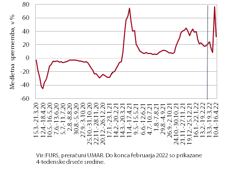

---
output:
  pdf_document: default

---

# 25.4.2022

email from Mojca asking for help on the y-o-y change in weekly VAT revenues - same chart as Andrej's electricity one last week. 

```{r echo=FALSE, out.width='100%'}

```

The issues are: 

* the data is weekly - although the publication is bi-weekly
* the data is weekly - but there is not enough room on the x-axis to label each week. 
* the data is weekly - but this can sometimes be very noisy, so maybe you don't want to show the full resolution. but you want it for the last 5-8 weeks or sth. so you manually draw a line separating the two lines, one unsmoothed and one smoothed. 